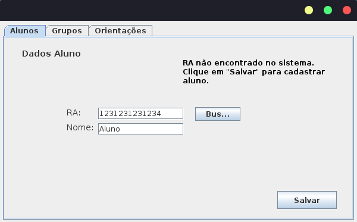
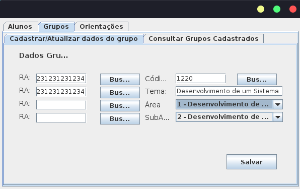
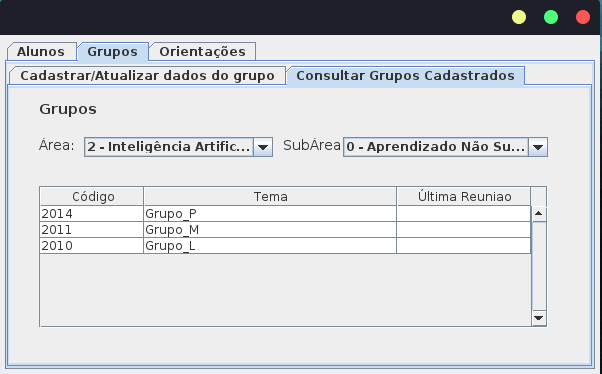
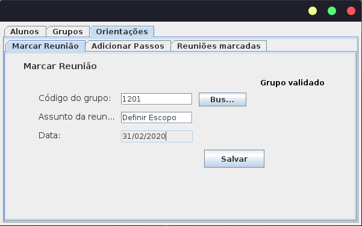
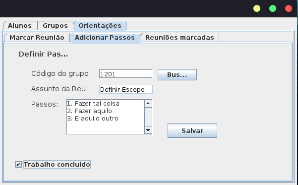
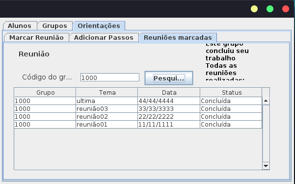
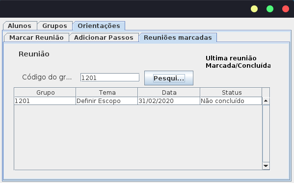

# Gestor-de-TCCs_Estrutura-de-Dados
Trabalho Semestral de Estrutura de Dados

****

O projeto, multiplataforma, tem como objetivo que um professor orientador de TCC possa gerenciar grupos e trabalhos de TCC.

****

## Integrantes:
- Débora Cristina https://github.com/DeboraCristina
- Luan Camilo Nogueira 
- Matheus França https://github.com/Matheus-Franca-x

# Funcionalidades

- Adicionar, Excluir e Atualizar dados de Alunos
- Adicionar, Excluir e Atualizar dados de Grupos
- Consultar Grupos por área de subárea
- Marcar e Atualizar Reuniões
- Marcar e Atualizar Tarefas para as próximas Reuniões
- Consultar as reuniões dos grupos.
	- Apenas a última reunião para grupos que não concluíram o Trabalho
	- Todas as reuniões para grupos que já concluíram o Trabalho

# Requisitos

Para que o programa funcione o diretório TEMP, presente no diretório 'ProjetoJava/DataBase/', deve estar no diretório do usuário.
 
Para usuários Windows:
`C:\users\UserName\TEMP`
 
Para usuários Linux:
`/home/UserName/TEMP`
 
Aonde `UserName` é o nome do usuário do computador.
 
 
Dentro do diretório TEMP, apenas o arquivo `ProfessorAreasdeAtuacao.csv` é **estritamente** necessário para o funcionamento do programa.

# Prints

 

 

 

 

 

 

